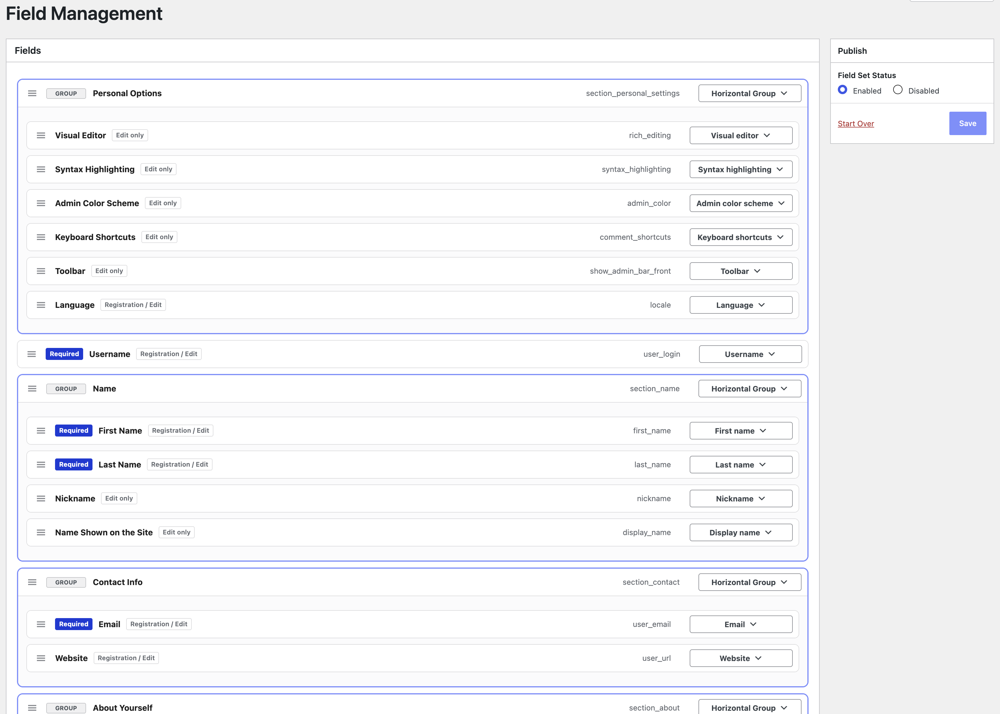
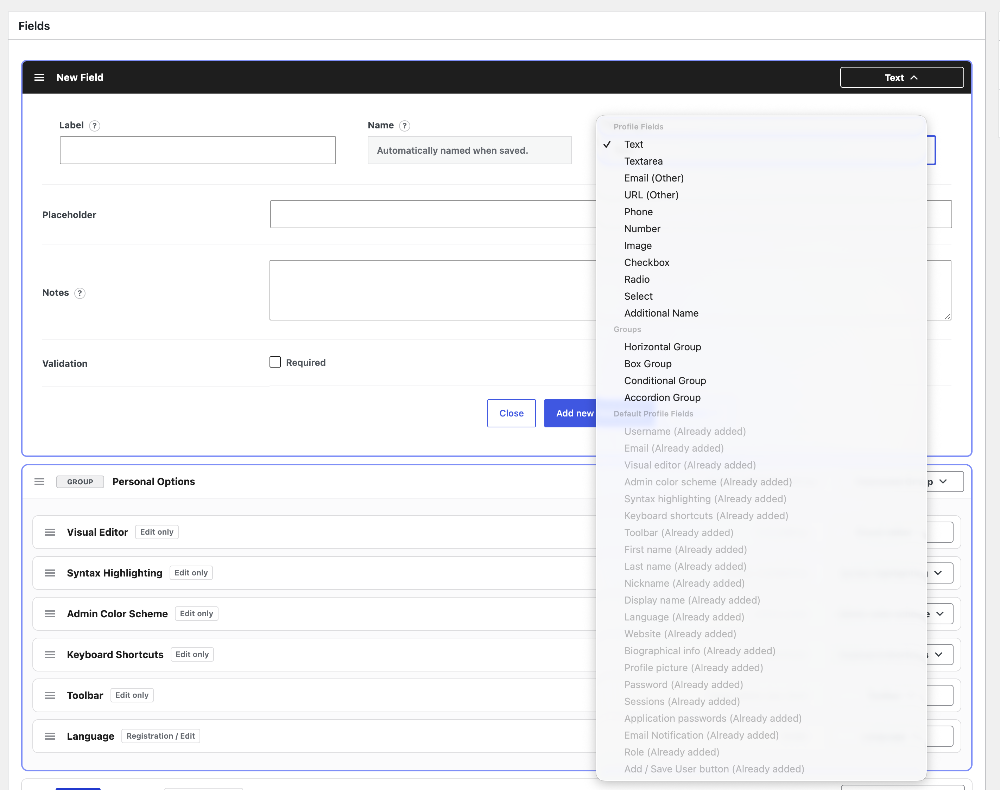
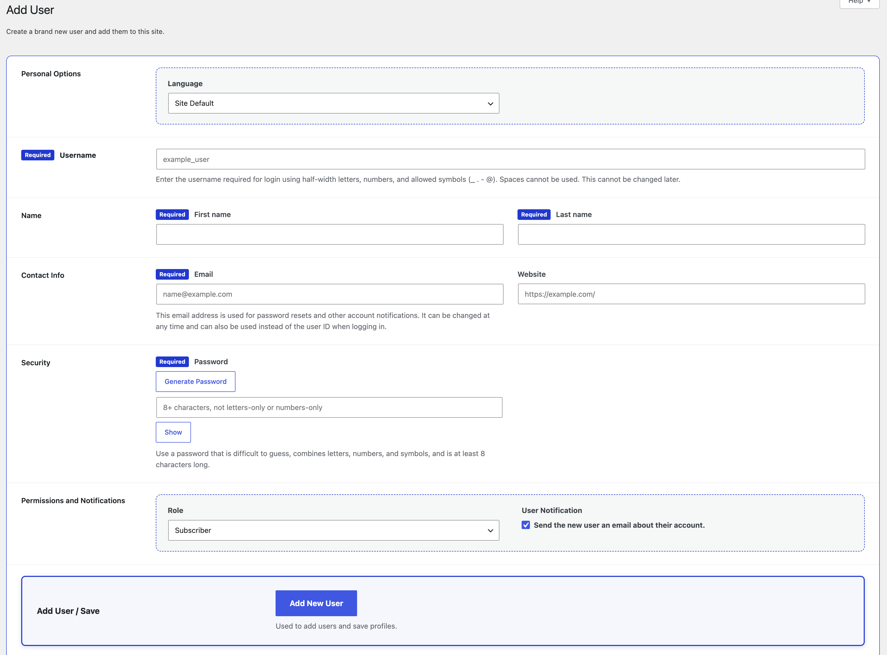

<div align="center">
  
  <h1>atshift User Profile Fields</h1>
  <p><strong>Turn the WordPress user profile screen into a clean, practical editing experience.</strong></p>
  <p>
    <a href="https://upf.at-shift.net/en/">Official Website</a> ·
    <a href="https://upf.at-shift.net/en/guide/">Setup Guide</a> ·
    <a href="https://upf.at-shift.net/en/output/">Reference</a> ·
    <a href="https://upf.at-shift.net/en/pro/">Pro Add-on</a> ·
    <a href="https://wordpress.org/plugins/atshift-user-profile-fields/">WordPress.org</a> ·
    <a href="https://upf.at-shift.net/">日本語</a>
  </p>
</div>

## Overview

atshift User Profile Fields lets WordPress administrators add the profile information their sites need and organize it together with the standard WordPress user fields.

Remove unnecessary settings, arrange fields in a natural order, and configure labels, descriptions, required input, field types, and layout for everyday user management. The result is a cleaner screen for adding and editing users without replacing WordPress's user system.

## Features

- Text, textarea, email, URL, phone, number, and image fields
- Checkboxes, radio buttons, and select menus
- Reordering and visibility controls for standard WordPress profile fields
- Groups, boxes, conditional sections, and accordions
- Required fields, field-specific validation, and descriptions
- Drag-and-drop ordering for fields and field sets
- Support for both Add New User and Edit User screens
- JSON export and import for reusable field sets
- Bundled English and Japanese WordPress profile presets

## Requirements

- WordPress 6.0 or later
- PHP 7.4 or later

## Installation

1. Install the plugin from [WordPress.org](https://wordpress.org/plugins/atshift-user-profile-fields/) or download a ZIP from [Releases](https://github.com/at-shift/atshift-user-profile-fields/releases).
2. In WordPress, open **Plugins > Add Plugin > Upload Plugin** and upload the ZIP.
3. Activate the plugin.
4. Open **atshift User Profile Fields > Field Management** in the WordPress admin menu.

See the [setup guide](https://upf.at-shift.net/en/guide/) for the complete workflow.

## Getting Started

The Field Management screen offers three ways to begin:

1. Build a field set from scratch.
2. Start with a bundled WordPress profile preset.
3. Import a field set exported from another site.

After saving the field set, open **Users > All Users** or **Users > Add User** and confirm that labels, descriptions, inputs, required indicators, and ordering appear as intended.

## Screenshots







## Retrieving Saved Values

Values added by the plugin can be retrieved with the provided helper or the standard WordPress user meta API.

```php
$value = atshift_upf_get_user_field( 'company', $user_id );
```

Most admin-only workflows do not require any custom output code. When displaying user information in a directory, public profile, or another frontend view, see the [display and output reference](https://upf.at-shift.net/en/output/).

## Pro Add-on

The optional Pro add-on extends the field sets created with the free plugin. It is installed alongside this free base plugin and is not included in this repository.

Pro adds user classifications, visibility and editing permissions, public profiles, user directories, and CSV workflows.

- [Pro add-on features](https://upf.at-shift.net/en/pro/)
- [Pro add-on pricing](https://upf.at-shift.net/en/price/)
- [Pro shortcode reference](https://upf.at-shift.net/en/shortcodes/)

## Documentation

| Topic | English | 日本語 |
| --- | --- | --- |
| Official website | [upf.at-shift.net/en](https://upf.at-shift.net/en/) | [upf.at-shift.net](https://upf.at-shift.net/) |
| Adding and arranging fields | [Setup guide](https://upf.at-shift.net/en/guide/) | [導入ガイド](https://upf.at-shift.net/guide/) |
| Retrieving and displaying values | [Display and output](https://upf.at-shift.net/en/output/) | [表示・出力](https://upf.at-shift.net/output/) |
| Pro Upgrade | [Upgrade to Pro](https://upf.at-shift.net/en/pro/) | [Proへアップグレード](https://upf.at-shift.net/pro/) |
| Pro shortcodes | [Shortcode reference](https://upf.at-shift.net/en/shortcodes/) | [リファレンス](https://upf.at-shift.net/shortcodes/) |

## Related Projects

- [atshift Freeform Login beta](https://upf.at-shift.net/en/freeform-login/) designs the WordPress login screen and provides a matching login form shortcode for site pages.
- [at-shift Fields](https://wordpress.org/plugins/atshift-fields-maintenance-for-custom-field-suite/) brings a similar field-building experience to posts and custom post types.

## Reporting Issues

Please use [GitHub Issues](https://github.com/at-shift/atshift-user-profile-fields/issues) and include reproduction steps together with your WordPress, PHP, and plugin versions.

## License

[GPL-2.0-or-later](LICENSE)
